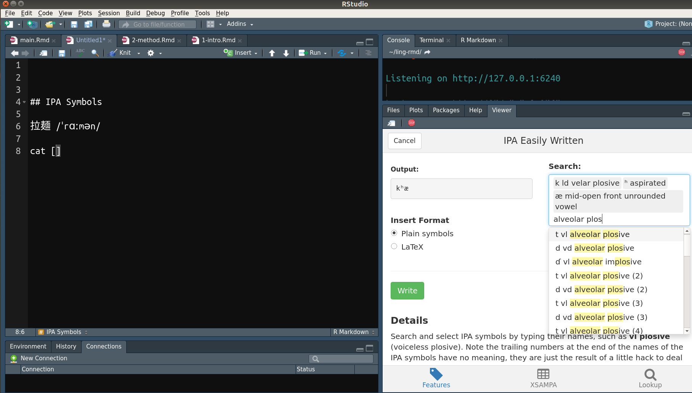

--- 
title: '臺大論文模板'
author: '廖永賦'
github-repo: "liao961120/ntuthesis"
date: "`r format(Sys.Date(), '%B %e, %Y')`" # Gitbook Date
site: bookdown::bookdown_site
## Opts above are for gitbook output; below are for PDF output
two-side: false  # Whether to start new chapter on odd pages
#secnumdepth: 2   # section numbering at most to x.y.z
indent: false    # Indent new paragraph, else adds space between paragraphs 
linestretch: 1.5   # If Chinese: 1.5
linestretch-code: 1  # linestretch for code chunks
watermark: watermark.png    # ntu watermark file (must be in root dir)
link-citations: yes         # internal links to references
bibliography: ref.bib
## Shouldn't touch things below unless familiar with R Markdown
#biblio-style: apa #authoryear
#biblatexoptions: [backend = biber, style = caspervector, utf8, sorting = cenyt]
#biblio-title: "biblatex 參考文獻"
links-as-notes: true
always_allow_html: yes
geometry: a4paper, left=1.18in, right=1.18in, top=1.18in, bottom=0.787in
subparagraph: yes
acknowledgements-title: '誌謝'
#acknowledgements: |
#  `r paste(readLines("_acknowledge.Rmd", encoding = "UTF-8"), collapse = "\n  ")`
#abstract-zh: |
#  `r x=readLines("_abstract-zh.Rmd", encoding = "UTF-8"); paste(x, collapse = "\n  ")`
#abstract-en: |
#  `r x=readLines("_abstract-en.Rmd", encoding = "UTF-8"); paste(x, collapse = "\n  ")`
---


`r if(knitr::is_html_output()) '
# 關於 {- #about}\n

這是 [ntuthesis](https://liao961120.github.io/ntuthesis) 的說明文件。這份說明文件是以臺大論文格式所寫成，並且可以輸出成 HTML（GitBook），亦即您目前所見的文件，或是 PDF，亦即完整的臺大論文（可透過 navbar 上的 <i class="fa fa-file-pdf-o"></i> 查看）。\n
\n
使用此論文模板應至少對 R Markdown 有初步的了解，例如知道 Markdown 的基本語法並且曾透過 R Markdown 輸出 html_document。
'`

<!-- 
Below are code that paste acknowledgement and abstract in GitBook output. 
Remove or wrap them around HTML comments if don't want to display them in GitBook.
-->

<!-- Acknowledgement -->
<!-- `r if(knitr::is_html_output()) '# 誌謝 {- #acknowledge}\n'` -->

<!-- `r if (knitr::is_html_output()) paste(readLines("_acknowledge.Rmd", encoding = "UTF-8"), collapse = "\n  ")` -->

<!-- Abstract -->
<!-- `r if(knitr::is_html_output()) '# 摘要 {- #abstract}\n'` -->

<!-- `r if (knitr::is_html_output()) paste(readLines("_abstract-zh.Rmd", encoding = "UTF-8")[5:length(readLines("_abstract-zh.Rmd", encoding = "UTF-8"))], collapse = '\n')` -->

<!-- keywords -->
<!-- `r if (knitr::is_html_output()) '<br><br>'` -->

<!-- `r if (knitr::is_html_output()) paste('**keywords:**', readLines("_abstract-zh.Rmd", encoding = "UTF-8")[2])` -->


```{r setup, include=FALSE}
knitr::opts_knit$set(root.dir='R')
#knitr::opts_chunk$set(fig.pos = 'H')
options(digits = 2) # round values of vars to 2 digits when printed
knitr::opts_chunk$set(
    #echo = FALSE,  # echo = FALSE hides themorem environment
    message = FALSE,
    warning = FALSE,
    comment="",
    fig.align = 'center',
    out.width = "100%"
    #fig.dim = c(3.5, 3.5)  # (width, height)
)
```


<!--chapter:end:index.Rmd-->

```{r echo=FALSE, include=TRUE}
klippy::klippy(position = c('top', 'right'),
               all_precode = TRUE)
```

# 安裝 {#install} 

### `v1.0.0` {-}

2019-02-10 之前已使用 `ntuthesis` 撰寫論文者，請下載 `v1.0.0`：
```r
#install.packages('remotes')
remotes::install_github("liao961120/ntuthesis@v1.0.0")
```

並請閱讀[第一版的說明文件](https://liao961120.github.io/ntuthesis/doc-v1)。

### 最新版 {-}
```r
#install.packages('remotes')
remotes::install_github("liao961120/ntuthesis")
```

安裝完成後，執行下方指令，下載套件所需的字體檔：
```
ntuthesis::download_fonts()
```

新版的 `ntuthesis` 較易加入其它學校模板，目前正在開發中，API 與舊版兼容，但舊的 `ntu_bookdown` 模板已更新為 `ntu`，並且不容於新版。已使用 `ntu_bookdown` 模板者，請下載 `v1.0.0`。


## IDE

建議使用 Rstudio，因為安裝 Rstudio 時，同時會安裝 Pandoc。若使用者使用 Rstudio 以外的 IDE，需要自行安裝並設定 Pandoc PATH，對使用者較為麻煩。


## LaTeX

若已有管理、安裝 LaTeX 套件經驗者，可忽略。

### tinytex 套件

若電腦尚未安裝 LaTeX，可安裝 R 的 tinytex 套件 (Mac 使用者可能會安裝失敗，見下文)：

```r
install.packages('tinytex')
```

接著，選擇**與電腦相同作業系統**的連結下載 TinyTeX Library[^portable]：

- [Linux x86_64](http://bit.ly/TinyTex-linux)
- [Windows 7/10 64bit](http://bit.ly/TinyTeX-win)
- Mac 使用者在安裝 TinyTeX Library 時**很可能會遇到問題**。請跳過下方內容，直接從 \@ref(mac) 節開始閱讀，幸運的話可以直接安裝成功。若失敗的話，可參考此二連結中的對話串：[tinytex installation pain on Mac](https://github.com/yihui/tinytex/issues/92) 與 [/usr/local/bin not writable](https://github.com/yihui/tinytex/issues/24)。

下載檔案後，

a) 將檔案解壓縮[^decompress]

a) 將解壓後資料夾中的 `.TinyTeX/`[^wintiny] 放至喜歡的路徑（e.g. `C:\Users\<username>\.TinyTeX`, 路徑儘量簡單且**不能包含中文字**）

a) 接著在 R 中執行：
```r
tinytex::use_tinytex()
```
即會跳出一個視窗。請選擇剛剛存放 `.TinyTeX/` 的路徑。


若失敗詳見[此篇文章](https://yihui.name/en/2018/08/tinytex-flash-drive)。


#### LaTeX 套件管理 {#tinytex-manage}

在輸出 R Markdown 時，tinytex 會自動安裝缺少的 LaTeX 套件。因此，使用 TinyTeX 可以減輕管理 LaTeX 套件的麻煩。然而，下載 LaTeX 套件需要許多時間，因此這裡提供預先下載好之 TinyTeX（Windows 和 Linux）。

##### Mac {#mac}

由於作者沒有 Mac 電腦，無法提供 Mac 版本的 TinyTeX，Mac 使用者需使用
```r
tinytex::install_tinytex()
```
安裝 TinyTeX，之後電腦在[輸出論文](#export-thesis)時，會自動安裝所需的套件。

(若安裝失敗，請看看是否錯誤訊息與此二討論串中類似：[tinytex installation pain on Mac](https://github.com/yihui/tinytex/issues/92)、[/usr/local/bin not writable](https://github.com/yihui/tinytex/issues/24))

這會使得第一次輸出論文時會花費較多時間，然而，若願意的話，您可以將下載到您電腦上的 TinyTeX 提供給其他 Mac 使用者：

成功輸出論文 PDF 後，執行
```r
tinytex::copy_tinytex()
```
即會跳出一個新視窗。選擇資料夾後，即會將電腦上的 TinyTeX 複製到此資料夾。如此，下一位使用者只須將此資料夾複製到電腦上，並用 `tinytex::use_tinytex()` 設定 TinyTeX 的路徑至該資料夾，即可節省輸出論文時安裝 LaTeX 套件所耗費的時間。
希望使用 Mac 成功輸出論文的使用者能將 TinyTeX 的壓縮檔或連結提供給我，讓其他的使用者受益。


[^wintiny]: 在 Windows 上是 `TinyTeX/`

[^decompress]: Linux 使用者可用 `tar -zxvf tinytex-linux.tar.gz` 指令解壓縮。Windows 使用者可用 [7-Zip](https://www.developershome.com/7-zip/) 解壓縮。

[^portable]: 根據 Yihui 的說明 (https://yihui.name/en/2018/08/tinytex-flash-drive)，TinyTex 具有可攜式（portable）的特性。

<!--chapter:end:01-1-install.Rmd-->

# 輸出論文 {#export-thesis}

## 匯入論文模板 {#import-template}

在 console 執行：
```r
ntuthesis::import_template("project_name")
```

接著將該資料夾變更為 bookdown 專案（working dir 需為該專案資料夾）：
```r
ntuthesis::init_proj()  # init working dir as proj.
```

詳細的檔案結構，見 \@ref(dir-structure)。

## 編輯封面 {#edit-front-matter}

在`_person-info.yml`輸入個人資料後執行：

```r
ntuthesis::comp_front()
```

即會在 `front-matter/` 生成封面所需的檔案。以使用者的角度而言，除了 `front-matter/certification.pdf` 以外，不須理會 `front-matter/` 中的其它檔案。`certification.pdf` 是空白（未簽名）的「口試委員審定書」。

使用者可以將 `front-matter/certification.pdf` 列印出來。之後再將簽名過的「口試委員審定書」掃描成 PDF 並命名為 `certification-scan.pdf` ，取代專案資料夾**根目錄**中的同名檔案。


## Compile 論文 {#compile-thesis}

使用 RStudio Build Pane 裡的 button 輸出論文：

```{r echo=FALSE, fig.cap="透過 RStudio 輸出論文"}
if (knitr::is_html_output()) {
  knitr::include_graphics("figs/build-button.gif")
} else {
  knitr::include_graphics("figs/build-button.png")
}
```

或是在 console 執行下方指令：
```r
bookdown::render_book("index.Rmd", "bookdown::gitbook")
bookdown::render_book("index.Rmd", "bookdown::pdf_book")
```

如此便會在 `_book/` 中生成完整的論文（gitbook 和 PDF 格式）。

<!--chapter:end:01-2-compile.Rmd-->

```{r echo=FALSE, include=TRUE}
klippy::klippy(position = c('top', 'right'),
               all_precode = TRUE)
```

# 論文撰寫 {#write-thesis}

## 檔案結構 {#dir-structure}

執行以下指令後（詳見 \@ref(import-template)）
```r
ntuthesis::import_template("project_name")
```

即會匯入論文模板。以下是論文模板的檔案結構（已簡化）：

```yaml
├── project_name.Rmd     # Useless, please delete it
|
├── R/                   # code chunk root dir, put R scripts and data here
├── figs/                # Put figures to include in the thesis here
|
├── index.Rmd            # Book Layout (font, watermark, biblio, ...)
├── _acknowledge.Rmd     # acknowledgement
├── _abstract-en.Rmd     # abstract
├── _abstract-zh.Rmd     # Same as above, but in Chinese
|
├── 01-intro.Rmd         # Chapter 1 content
├── 02-literature.Rmd    # Chapter 2 content
├── 03-method.Rmd        # Chapter 3 content
├── 80-appx-help.Rmd     # Appendix Content
├── 99-references.Rmd    # Edit "References" Title
├── ref.bib              # References
├── cite-style.csl       # Citation style
|
├── _bookdown.yml        # label names in gitbook; Rmd files order
├── _output.yml          # preamble, pandoc args, cite-pkg
|
├── watermark.pdf        # 臺大浮水印 (PDF 右上角)
├── _person-info.yml      # Info to generate front matter
├── certification-scan.pdf  # 已簽名'口試委員審查書'
└── front_matter
    └── certification.pdf   # 空白'口試委員審查書'
```

## `index.Rmd` {#index-rmd}

`index.Rmd` 是設定論文內文格式的地方，包含 yaml 以及 R setup code chunk。此模板將 code chunk 預設的 working directory 改成 `R/`[^code-root-dir]，如此較符合一般寫 Rscript 的邏輯[^relative-path]。若要更改此設定，至 setup code chunk 更改 `knitr::opts_knit$set(root.dir='R')`。

[^code-root-dir]: 預設是 Rmd 檔所在的位置。

[^relative-path]: 例如，使用相對路徑匯入資料時，一般會以 Rscript 所在的位置作為基準。

## 撰寫語言 {#write-lang}

若使用**英文**撰寫論文，需修改 `_output.yml`、`_bookdown.yml` 這兩個檔案的內容。

### `_output.yml`

將 `in_header: latex/preamble-zh.tex` 改為 `in_header: latex/preamble-en.tex`：

```yaml
bookdown::pdf_book:
  includes:
    in_header: latex/preamble-en.tex
```

### `_bookdown.yml`

`_bookdown.yml` 中，可以對標籤的名稱進行定義。這裡的設定與 PDF 輸出無關，只與 gitbook 輸出格式有關。因此，若無需使用 gitbook 輸出，可忽略此段。

此外，`_bookdown.yml` 亦可設定 Rmd 檔在輸出文件中的順序。若無設定，就會依序檔名排序[^order]。

在以下設定中，可使 gitbook 輸出的章節（順序）與 PDF 不同。
```yaml
rmd_files:
  html: ["index.Rmd", "abstract.Rmd", "intro.Rmd"]
  latex: ["abstract.Rmd", "intro.Rmd"]
```

[^order]: 此模板即未進行設定，因此第一章的內容寫在 `01-xxx.Rmd` 就會自動排在第一。而若檔名以底線開頭（`_`）則會被忽略。更多內容詳見 [bookdown](https://bookdown.org/yihui/bookdown/usage.html)。


## 文獻引用 {#bib-cite}

R Markdown 在文章中插入引用文獻的功能承繼 Pandoc。完整的使用見 [R Markdown 官方說明](https://rmarkdown.rstudio.com/authoring_bibliographies_and_citations.html) 。


此模板目前產生文獻格式的方法是依靠 [Pandoc citeproc](https://github.com/jgm/pandoc-citeproc)，因此，文獻格式是依據 `cite-style.csl`[^csl-ori] 產生的。使用者可至 [Zotero Style Repository](https://www.zotero.org/styles) 下載所需的 csl 檔並覆蓋專案資料夾中的 `cite-style.csl`。

[^csl-ori]: 此模板提供的 `cite-style.csl` 是 APA 英文第六版。此外，<http://blog.pulipuli.info/2011/05/zoteroapa.html> 亦有提供 APA 中文版的引用格式。需注意的是 Pandoc **不支援雙語 csl** (<http://blog.pulipuli.info/2014/08/zoteroapa-zotero-citation-style-apa.html>)。

### `ref.bib` {#ref-bib}

`.bib` 檔的產生方式可以由 Endnote, Zotero, JabRef 等書目管理軟體匯出。匯出後，將檔名命名為 `ref.bib` 放在專案資料夾[^refbib]。


[^refbib]: 或是可以自訂檔名，並到 `index.Rmd` yaml 中的 `bibliography: ref.bib` 更改 `ref.bib` 檔名。此外，亦可使用多個 `.bib` 檔：`bibliography: [ref1.bib, ref2.bib, ref3.bib]`。

`.bib` 內的一篇引用資料會類似：

```bib
@article{leung2008,
  title = {Multicultural Experience Enhances Creativity: {{The}} When and How.},
  volume = {63},
  issn = {1935-990X(Electronic),0003-066X(Print)},
  doi = {10.1037/0003-066X.63.3.169},
  number = {3},
  journaltitle = {American Psychologist},
  date = {2008},
  pages = {169-181},
  keywords = {*Cognition,*Creativity,
    *Culture (Anthropological),
    *Experiences (Events),Multiculturalism},
  author = {Leung, Angela Ka-yee and 
    Maddux, William W. and 
    Galinsky, Adam D. and Chiu, Chi-yue}
}
```

其中第一行的 `leung2008` 即為 citation key。透過 `@citekey`(`@leung2008`)即可在文獻中插入 citation。匯出論文時，文末會自動產生引用的文獻。

### 引用語法 {#cite-syntax}

[`citr`](https://github.com/crsh/citr) 是一個方便使用者插入引用文獻的 R 套件，讓使用者能透過 GUI 插入文獻：
```{r fig.cap="使用 citr 套件插入引用文獻", echo=FALSE}
if (knitr::is_html_output()){
  knitr::include_graphics("figs/citr.gif")
} else {
  knitr::include_graphics("figs/citr.png")
}
```

當需要更複雜的引用格式，如標示第幾頁，可以修改透過 `citr` 插入的語法：

- `Some text [@citekey].`
    - Some text [@leung2008].

- `@citekey Some text`
    - @leung2008 Some text 

- `@citekey [p. 20] Some text.`
    - @leung2008 [p. 20] Some text.

- `Some text [-@citekey].`
    - Some text [-@leung2008]

- `Some text [@citekey1; @citekey2].`
    -  Some text [@leung2008; @huangxuanfan1993].

- Prefix & Suffix
    - `Text [see @citekey1 pp.45; also, @citekey2 ch. 2].`
    -  Text [see @leung2008 pp. 45; also, @huangxuanfan1993 ch. 2].

### 書目管理軟體 {#ref-manager}

這裡建議使用 Zotero 加上 [Better BibTeX](https://retorque.re/zotero-better-bibtex/) 擴充功能。`citr` 對 Zotero 有額外的支持，且 **Zotero 能夠控制 citation key 的格式**（例如，last name + year），但其它書目管理軟體如 Endnote 產生的 citation key 難以讀懂且無法更改格式。

### 多語言文獻引用 {#multi-lang-cite}

透過 csl 排版引用格式，只能支援單一語言。例如，若將英文格式套用到中文文獻，中文文獻就會出現英文的半形逗點和句點。

多語言的引用或許可透過 LaTeX 的引用套件達成，但由於作者本人對 LaTeX 不夠熟悉，目前尚未解決此問題。若您是 LaTeX 的高手，歡迎至附錄 \@ref(latex-cite-pkg) 給我一些指教。

<!--chapter:end:02-write-thesis.Rmd-->

```{r echo=FALSE, include=TRUE}
klippy::klippy(position = c('top', 'right'),
               all_precode = TRUE)
```

# 語法 Cheatsheet {#cheatsheet}

下文許多內容直接自 [Bookdown](https://bookdown.org/yihui/bookdown/markdown-extensions-by-bookdown.html) 擷取。想完整了解者，請閱讀 Bookdown 中的內容。

## 章節連結 {#chapter-cross-ref}

### 錨點定義 {#define-anchor}

在內文中，可以使用特殊語法建立前往其它章節的連結，但首先每個章節需要有**錨點**。若章節標題由英數組成，例如 `## Experimental Design`， 則錨點會自動被定義成 `experimental-design`。若**標題含有中文**，例如 `## 實驗設計` 則需**自行定義錨點**：`## 實驗設計 {#exp-design}`。

### 內文連結

要在內文建立連至其它章節的連結，需使用 `\@ref(anchor)` 的語法，例如，

- 連結至 `## Experimental Design`
    - `\@ref(experimental-design)`
- 連結至 `## 實驗設計 {#exp-design}`
    - `\@ref(exp-design)`


## 數學 {#math}

### Unnumbered Equations

```latex
\begin{equation*} 
\frac{d}{dx}\left( \int_{a}^{x} f(u)\,du\right)=f(x)
\end{equation*} 
```

\begin{equation*} 
\frac{d}{dx}\left( \int_{a}^{x} f(u)\,du\right)=f(x)
\end{equation*} 


### Numbered Equations
```latex
\begin{equation} 
  f\left(k\right) = \binom{n}{k} p^k\left(1-p\right)^{n-k}
  (\#eq:bino)
\end{equation} 

式 \@ref(eq:bino)
```

\begin{equation} 
  f\left(k\right) = \binom{n}{k} p^k\left(1-p\right)^{n-k}
  (\#eq:binom)
\end{equation} 

式 \@ref(eq:binom)


### Multi-line Aligned Equations

```latex
\begin{equation} 
\begin{split}
\mathrm{Var}(\hat{\beta}) & =\mathrm{Var}((X'X)^{-1}X'y)\\
 & =(X'X)^{-1}X'\mathrm{Var}(y)((X'X)^{-1}X')'\\
 & =(X'X)^{-1}X'\mathrm{Var}(y)X(X'X)^{-1}\\
 & =(X'X)^{-1}X'\sigma^{2}IX(X'X)^{-1}\\
 & =(X'X)^{-1}\sigma^{2}
\end{split}
(\#eq:var-beta)
\end{equation}

詳見公式 \@ref(eq:var-beta)
```

\begin{equation} 
\begin{split}
\mathrm{Var}(\hat{\beta}) & =\mathrm{Var}((X'X)^{-1}X'y)\\
 & =(X'X)^{-1}X'\mathrm{Var}(y)((X'X)^{-1}X')'\\
 & =(X'X)^{-1}X'\mathrm{Var}(y)X(X'X)^{-1}\\
 & =(X'X)^{-1}X'\sigma^{2}IX(X'X)^{-1}\\
 & =(X'X)^{-1}\sigma^{2}
\end{split}
(\#eq:var-bet)
\end{equation} 

詳見公式 \@ref(eq:var-bet)

### 定理與證明 {#theorem-proof}

````markdown
`r ''````{theorem, thm-label, name="Pythagorean theorem"}
For a right triangle, if $c$ denotes the length of the hypotenuse
and $a$ and $b$ denote the lengths of the other two sides, we have

$$a^2 + b^2 = c^2$$
```

詳見定理 \@ref(thm:thm-label)
````

```{theorem, pyth, name="Pythagorean theorem"}
For a right triangle, if $c$ denotes the length of the hypotenuse
and $a$ and $b$ denote the lengths of the other two sides, we have
$$a^2 + b^2 = c^2$$
```

詳見定理 \@ref(thm:pyth)


### 環境 {#environment}

除了 `theorem` 之外，還可以使用其它 bookdown 提供的環境。例如，將 code chunk 中 `theorem` 換成 `proof`, `remark`, `solution`[^env-crossref]。

[^env-crossref]: `theorem`、`proof`、`remark` 這三者無法被 cross-reference。

表 \@ref(tab:theorem-envs) 呈現 bookdown 中的[引用環境](https://bookdown.org/yihui/bookdown/markdown-extensions-by-bookdown.html#tab:theorem-envs)。

(ref:theorem-env) Theorem environments in **bookdown**.

```{r theorem-envs, echo=FALSE}
knitr::kable(data.frame(
  Environment = names(bookdown:::theorem_abbr),
  `Printed Name` = unname(unlist(bookdown:::label_names_math)),
  `Label Prefix` = unname(bookdown:::theorem_abbr),
  stringsAsFactors = FALSE, check.names = FALSE
), caption = '(ref:theorem-env)', booktabs = TRUE)
```


## Figure Referencing

````markdown
`r ''````{r iris, fig.cap= "The iris data."}
library(ggplot2)
pl_iris <- ggplot(data = iris) +
             geom_point(aes(x = Sepal.Length,
                            y = Sepal.Width,
                            color = Species)
                        )
pl_iris
```
````

```{r iris, fig.cap= "The iris data.", out.width="70%", echo=FALSE}
library(ggplot2)
pl_iris <- ggplot(data = iris) +
             geom_point(aes(x = Sepal.Length,
                            y = Sepal.Width,
                            color = Species)
                        )
pl_iris
```


`見圖 \@ref(fig:iris)`產生：見圖 \@ref(fig:iris)

### Figure Caption

對於比較複雜的 caption，可以使用 Text reference 的方式：

````markdown
對於比較複雜的 caption，可以使用 Text reference 的方式：

(ref:dia) 插入**引用資料** [@kassin2017] 的 Figure Caption.

`r ''````{r dia, fig.cap='(ref:dia)', fig.show='hold', out.width=c('48%','48%')}
ggplot(data = diamonds) +
  geom_point(aes(x = carat, 
                 y = price,
                 color = cut),
             size = 0.1) +
  guides(color = guide_legend(
    override.aes = list(size = 2)
    ))

pl_iris # Second figure
```
````

(ref:foo) 插入**引用資料** [@kassin2017] 的 Figure Caption.

```{r foo, echo=FALSE, fig.cap='(ref:foo)', fig.show='hold', out.width=c('48%','48%')}
ggplot(data = diamonds) +
  geom_point(aes(x = carat, 
                 y = price,
                 color = cut),
             size = 0.1) +
  guides(color = guide_legend(
    override.aes = list(size = 2)
    ))

pl_iris   # Second figure
```


## Table Referencing

```{r include=FALSE}
str <- '`r Sys.time()`'
```

````markdown
(ref:mtcars) Dynamic variable in caption: `r str`.

`r ''````{r mtcars, echo=FALSE}
knitr::kable(
  head(mtcars[, 1:8], 5), booktabs = TRUE,
  caption = '(ref:mtcars)'
  )
```

### Link Table in Later Sections {-}
見表 \@ref(tab:mtcars)
````


(ref:mtcar) Dynamic variable in caption: `r Sys.time()`.

```{r mtcar, echo=FALSE}
knitr::kable(
  head(mtcars[, 1:8], 5), booktabs = TRUE,
  caption = '(ref:mtcar)'
  )
```

### Link Table in Later Sections {-}
見表 \@ref(tab:mtcar)


## 總整理

- `\@ref(section-anchor)`
- `(ref:mtcar) Text refereces`
- `\@ref(fig:fig-label)`
    - `fig-label` is code chunk label
- `\@ref(thm:thm-label)`
    - `thm-label` is code chunk label
- `\@ref(tab:tab-label)`
    - `tab-label` is code chunk label. Use text reference for complicated captions.
- `\@ref(eq:eq-label)`
    - Defined as `(\#eq:eq-label)` in LaTeX equation environment


<!--chapter:end:03-bookdown-demo.Rmd-->

```{r echo=FALSE, include=TRUE}
klippy::klippy(position = c('top', 'right'),
               all_precode = TRUE)
```

# 進階功能擴充 {#add-on}

透過其它 R 套件，R Markdown 的撰寫過程能夠更順暢。以下介紹幾個例子，歡迎補充說明。


## 語言學 {#ling}

語言學相關文件寫作時，常需要插入 IPA 語音符號，但鍵盤通常難以直接打出這些符號。為此，我寫了一個 R 套件，讓使用者能直接在 RStudio 中透過輸入語音 features 的方式打出 IPA：

```{r echo=FALSE, fig.cap="使用 linguisticsdown 套件插入 IPA 音標符號"}
if (knitr::is_html_output()) {
  knitr::include_graphics("https://liao961120.github.io/linguisticsdown/man/figs/features.gif")
} else {
  
  }
```
<br>

要使用這功能，需安裝 `linguisticsdown`：
```r
install.packages("linguisticsdown")
```

關於更詳細的功能，見[套件網頁](https://liao961120.github.io/linguisticsdown/)

<!--chapter:end:04-specific-extension.Rmd-->

# 問題協助 {- #feed-back}


## 提出問題 {- #issue}

若使用此模板遇到困難不知如何解決，可以透過下列管道聯絡我（按優先順序排列）：

1. 提出 [GitHub issue](https://github.com/liao961120/ntuthesis/issues)（需有 GitHub 帳號）
1. 直接在這份說明文件中**與問題相關的章節**留言（頁面最下方的 disqus 留言）
1. 除非有特殊的原因，**請勿透過電子郵件提出問題**。公開自己的問題對其他人有很大的幫助，也能避免將時間浪費在重複回答相同的問題。


## R Markdown 相關資源 {- #rmd-resources}

以下都是 R Markdown 相關的參考資源。與此論文模板最直接相關的是 *Bookdown*。*R Markdown: The Definitive Guide* 幾乎涵蓋了 R Markdown 的所有用途（例如，投影片製作）。Pandoc 則是 R Markdown 能夠支援多種輸出格式的關鍵，因為 R Markdown 的格式輸出是仰賴 Pandoc 模板（也是這個論文模板的製作方式）且 R Markdown 的 Markdown 語法即是 Pandoc Markdown 的語法。

- [Bookdown](https://bookdown.org/yihui/bookdown)

- [R Markdown: The Definitive Guide](https://bookdown.org/yihui/rmarkdown)

- [Pandoc User’s Guide](http://pandoc.org/MANUAL.html)


## Improve the Project {-}

最後，若您發現這份論文模板有錯誤或是可以改進的地方，同樣可以依上述的[步驟](#issue)提出問題。甚至如果知道如何解決問題，歡迎直接提出 pull request。pull request 的範圍不限在模板本身。若您看到這份文件中有任何錯誤，可以直接透過 navbar 上的 <i class="fa fa-edit"></i> 修改文件。

<!--chapter:end:50-feedback.Rmd-->

# (APPENDIX) 附錄 {-}

# 尋找 LaTeX 高手 {#latex-cite-pkg}

R Markdown 的 PDF 輸出是透過 Pandoc 的 LaTeX 模板，因此理論上 LaTeX 可以做到的事，也可以透過 R Markdown 達成。目前的問題是

> LaTeX 本身並未有支援繁體中文格式的文獻引用套件

經過一段時間的搜尋，發現 biblatex 套件似乎可以定義不同的引用格式[^biblatex] [^biblatex2]，因此，或許可以透過定義新的標點符號，例如將原本引用格式中

- `,` 定義成 `，`
- `.` 定義成 `。`

再透過 `.bib` 檔中的 `langid` field 辨識要使用何種引用格式。然而，由於作者本人對 LaTeX 並不熟悉，因此需要這方面熟手的協助。


[^biblatex]: https://tex.stackexchange.com/questions/417762/different-styles-between-citations-and-bibliography

[^biblatex2]: https://tex.stackexchange.com/questions/377308/different-citation-styles-for-the-same-bibliography

<!--chapter:end:80-appx-help.Rmd-->

# 後記 {#epilogue}

> I have a dream that one day all students and researchers will forget what "formatting a paper" even means. I have a dream that one day journals and grad schools no longer have style guides. I have a dream that one day no missing \$ is inserted, and \\hbox is never overfull.
>
> \hspace*{\fill} --- [Yihui Xie](https://twitter.com/xieyihui/status/1022873179532996609)


<br>

R Markdown 的精神之一就是希望能免除使用者排版的困擾。在認識 R Markdown 的第一天後，我就希望未來（如果有機會的話）可以用 R Markdown 寫論文。但從第一次嘗試用 R Markdown 輸出中文 PDF 時，我就意識到這是一件麻煩事[^fck-latex]。換句話說，應該等不到有人幫我做出論文模板的一天。因此，自己就站在前輩們的肩膀上[^base]，做出了這個論文模板。

[^base]: 包含 tzhuan/ntu-thesis (https://github.com/tzhuan/ntu-thesis) 的 XeLaTeX 台大論文模板、thesisdown (https://github.com/ismayc/thesisdown) 的啟發、Pandoc 以及 Bookdown 和 R Markdown 的生態系統。

[^fck-latex]: 這一切都起源於 LaTeX 的複雜度。

<!--chapter:end:82-appx-epilogue.Rmd-->

\renewcommand{\href}{\oldhref}

# 參考資料 {- #references}

<!--chapter:end:90-references.Rmd-->

--- 
title: '臺大論文模板'
author: '廖永賦'
github-repo: "liao961120/ntuthesis"
date: "`r format(Sys.Date(), '%B %e, %Y')`" # Gitbook Date
site: bookdown::bookdown_site
## Opts above are for gitbook output; below are for PDF output
two-side: false  # Whether to start new chapter on odd pages
#secnumdepth: 2   # section numbering at most to x.y.z
indent: false    # Indent new paragraph, else adds space between paragraphs 
linestretch: 1.5   # If Chinese: 1.5
linestretch-code: 1  # linestretch for code chunks
watermark: watermark.png    # ntu watermark file (must be in root dir)
link-citations: yes         # internal links to references
bibliography: ref.bib
## Shouldn't touch things below unless familiar with R Markdown
#biblio-style: apa #authoryear
#biblatexoptions: [backend = biber, style = caspervector, utf8, sorting = cenyt]
#biblio-title: "biblatex 參考文獻"
links-as-notes: true
always_allow_html: yes
geometry: a4paper, left=1.18in, right=1.18in, top=1.18in, bottom=0.787in
subparagraph: yes
acknowledgements-title: '誌謝'
#acknowledgements: |
#  `r paste(readLines("_acknowledge.Rmd", encoding = "UTF-8"), collapse = "\n  ")`
#abstract-zh: |
#  `r x=readLines("_abstract-zh.Rmd", encoding = "UTF-8"); paste(x, collapse = "\n  ")`
#abstract-en: |
#  `r x=readLines("_abstract-en.Rmd", encoding = "UTF-8"); paste(x, collapse = "\n  ")`
---


`r if(knitr::is_html_output()) '
# 關於 {- #about}\n

這是 [ntuthesis](https://liao961120.github.io/ntuthesis) 的說明文件。這份說明文件是以臺大論文格式所寫成，並且可以輸出成 HTML（GitBook），亦即您目前所見的文件，或是 PDF，亦即完整的臺大論文（可透過 navbar 上的 <i class="fa fa-file-pdf-o"></i> 查看）。\n
\n
使用此論文模板應至少對 R Markdown 有初步的了解，例如知道 Markdown 的基本語法並且曾透過 R Markdown 輸出 html_document。
'`

<!-- 
Below are code that paste acknowledgement and abstract in GitBook output. 
Remove or wrap them around HTML comments if don't want to display them in GitBook.
-->


```{r setup, include=FALSE}
knitr::opts_knit$set(root.dir='R')
#knitr::opts_chunk$set(fig.pos = 'H')
options(digits = 2) # round values of vars to 2 digits when printed
knitr::opts_chunk$set(
    #echo = FALSE,  # echo = FALSE hides themorem environment
    message = FALSE,
    warning = FALSE,
    comment="",
    fig.align = 'center',
    out.width = "100%"
    #fig.dim = c(3.5, 3.5)  # (width, height)
)
```


<!--chapter:end:index.Rmd-->

```{r echo=FALSE, include=TRUE}
klippy::klippy(position = c('top', 'right'),
               all_precode = TRUE)
```

# 安裝 {#install} 

### `v1.0.0` {-}

2019-02-10 之前已使用 `ntuthesis` 撰寫論文者，請下載 `v1.0.0`：
```r
#install.packages('remotes')
remotes::install_github("liao961120/ntuthesis@v1.0.0")
```

並請閱讀[第一版的說明文件](https://liao961120.github.io/ntuthesis/doc-v1)。

### 最新版 {-}
```r
#install.packages('remotes')
remotes::install_github("liao961120/ntuthesis")
```

安裝完成後，執行下方指令，下載套件所需的字體檔：
```
ntuthesis::download_fonts()
```

新版的 `ntuthesis` 較易加入其它學校模板，目前正在開發中，API 與舊版兼容，但舊的 `ntu_bookdown` 模板已更新為 `ntu`，並且不容於新版。已使用 `ntu_bookdown` 模板者，請下載 `v1.0.0`。


## IDE

建議使用 Rstudio，因為安裝 Rstudio 時，同時會安裝 Pandoc。若使用者使用 Rstudio 以外的 IDE，需要自行安裝並設定 Pandoc PATH，對使用者較為麻煩。


## LaTeX

若已有管理、安裝 LaTeX 套件經驗者，可忽略。

### tinytex 套件

若電腦尚未安裝 LaTeX，可安裝 R 的 tinytex 套件 (Mac 使用者可能會安裝失敗，見下文)：

```r
install.packages('tinytex')
```

接著，選擇**與電腦相同作業系統**的連結下載 TinyTeX Library[^portable]：

- [Linux x86_64](http://bit.ly/TinyTex-linux)
- [Windows 7/10 64bit](http://bit.ly/TinyTeX-win)
- Mac 使用者在安裝 TinyTeX Library 時**很可能會遇到問題**。請跳過下方內容，直接從 \@ref(mac) 節開始閱讀，幸運的話可以直接安裝成功。若失敗的話，可參考此二連結中的對話串：[tinytex installation pain on Mac](https://github.com/yihui/tinytex/issues/92) 與 [/usr/local/bin not writable](https://github.com/yihui/tinytex/issues/24)。

下載檔案後，

a) 將檔案解壓縮[^decompress]

a) 將解壓後資料夾中的 `.TinyTeX/`[^wintiny] 放至喜歡的路徑（e.g. `C:\Users\<username>\.TinyTeX`, 路徑儘量簡單且**不能包含中文字**）

a) 接著在 R 中執行：
```r
tinytex::use_tinytex()
```
即會跳出一個視窗。請選擇剛剛存放 `.TinyTeX/` 的路徑。


若失敗詳見[此篇文章](https://yihui.name/en/2018/08/tinytex-flash-drive)。


#### LaTeX 套件管理 {#tinytex-manage}

在輸出 R Markdown 時，tinytex 會自動安裝缺少的 LaTeX 套件。因此，使用 TinyTeX 可以減輕管理 LaTeX 套件的麻煩。然而，下載 LaTeX 套件需要許多時間，因此這裡提供預先下載好之 TinyTeX（Windows 和 Linux）。

##### Mac {#mac}

由於作者沒有 Mac 電腦，無法提供 Mac 版本的 TinyTeX，Mac 使用者需使用
```r
tinytex::install_tinytex()
```
安裝 TinyTeX，之後電腦在[輸出論文](#export-thesis)時，會自動安裝所需的套件。

(若安裝失敗，請看看是否錯誤訊息與此二討論串中類似：[tinytex installation pain on Mac](https://github.com/yihui/tinytex/issues/92)、[/usr/local/bin not writable](https://github.com/yihui/tinytex/issues/24))

這會使得第一次輸出論文時會花費較多時間，然而，若願意的話，您可以將下載到您電腦上的 TinyTeX 提供給其他 Mac 使用者：

成功輸出論文 PDF 後，執行
```r
tinytex::copy_tinytex()
```
即會跳出一個新視窗。選擇資料夾後，即會將電腦上的 TinyTeX 複製到此資料夾。如此，下一位使用者只須將此資料夾複製到電腦上，並用 `tinytex::use_tinytex()` 設定 TinyTeX 的路徑至該資料夾，即可節省輸出論文時安裝 LaTeX 套件所耗費的時間。
希望使用 Mac 成功輸出論文的使用者能將 TinyTeX 的壓縮檔或連結提供給我，讓其他的使用者受益。


[^wintiny]: 在 Windows 上是 `TinyTeX/`

[^decompress]: Linux 使用者可用 `tar -zxvf tinytex-linux.tar.gz` 指令解壓縮。Windows 使用者可用 [7-Zip](https://www.developershome.com/7-zip/) 解壓縮。

[^portable]: 根據 Yihui 的說明 (https://yihui.name/en/2018/08/tinytex-flash-drive)，TinyTex 具有可攜式（portable）的特性。

<!--chapter:end:01-1-install.Rmd-->

# 輸出論文 {#export-thesis}

## 匯入論文模板 {#import-template}

在 console 執行：
```r
ntuthesis::import_template("project_name")
```

接著將該資料夾變更為 bookdown 專案（working dir 需為該專案資料夾）：
```r
ntuthesis::init_proj()  # init working dir as proj.
```

詳細的檔案結構，見 \@ref(dir-structure)。

## 編輯封面 {#edit-front-matter}

在`_person-info.yml`輸入個人資料後執行：

```r
ntuthesis::comp_front()
```

即會在 `front-matter/` 生成封面所需的檔案。以使用者的角度而言，除了 `front-matter/certification.pdf` 以外，不須理會 `front-matter/` 中的其它檔案。`certification.pdf` 是空白（未簽名）的「口試委員審定書」。

使用者可以將 `front-matter/certification.pdf` 列印出來。之後再將簽名過的「口試委員審定書」掃描成 PDF 並命名為 `certification-scan.pdf` ，取代專案資料夾**根目錄**中的同名檔案。


## Compile 論文 {#compile-thesis}

使用 RStudio Build Pane 裡的 button 輸出論文：

```{r echo=FALSE, fig.cap="透過 RStudio 輸出論文"}
if (knitr::is_html_output()) {
  knitr::include_graphics("figs/build-button.gif")
} else {
  knitr::include_graphics("figs/build-button.png")
}
```

或是在 console 執行下方指令：
```r
bookdown::render_book("index.Rmd", "bookdown::gitbook")
bookdown::render_book("index.Rmd", "bookdown::pdf_book")
```

如此便會在 `_book/` 中生成完整的論文（gitbook 和 PDF 格式）。

<!--chapter:end:01-2-compile.Rmd-->

```{r echo=FALSE, include=TRUE}
klippy::klippy(position = c('top', 'right'),
               all_precode = TRUE)
```

# 論文撰寫 {#write-thesis}

## 檔案結構 {#dir-structure}

執行以下指令後（詳見 \@ref(import-template)）
```r
ntuthesis::import_template("project_name")
```

即會匯入論文模板。以下是論文模板的檔案結構（已簡化）：

```yaml
├── project_name.Rmd     # Useless, please delete it
|
├── R/                   # code chunk root dir, put R scripts and data here
├── figs/                # Put figures to include in the thesis here
|
├── index.Rmd            # Book Layout (font, watermark, biblio, ...)
├── _acknowledge.Rmd     # acknowledgement
├── _abstract-en.Rmd     # abstract
├── _abstract-zh.Rmd     # Same as above, but in Chinese
|
├── 01-intro.Rmd         # Chapter 1 content
├── 02-literature.Rmd    # Chapter 2 content
├── 03-method.Rmd        # Chapter 3 content
├── 80-appx-help.Rmd     # Appendix Content
├── 99-references.Rmd    # Edit "References" Title
├── ref.bib              # References
├── cite-style.csl       # Citation style
|
├── _bookdown.yml        # label names in gitbook; Rmd files order
├── _output.yml          # preamble, pandoc args, cite-pkg
|
├── watermark.pdf        # 臺大浮水印 (PDF 右上角)
├── _person-info.yml      # Info to generate front matter
├── certification-scan.pdf  # 已簽名'口試委員審查書'
└── front_matter
    └── certification.pdf   # 空白'口試委員審查書'
```

## `index.Rmd` {#index-rmd}

`index.Rmd` 是設定論文內文格式的地方，包含 yaml 以及 R setup code chunk。此模板將 code chunk 預設的 working directory 改成 `R/`[^code-root-dir]，如此較符合一般寫 Rscript 的邏輯[^relative-path]。若要更改此設定，至 setup code chunk 更改 `knitr::opts_knit$set(root.dir='R')`。

[^code-root-dir]: 預設是 Rmd 檔所在的位置。

[^relative-path]: 例如，使用相對路徑匯入資料時，一般會以 Rscript 所在的位置作為基準。

## 撰寫語言 {#write-lang}

若使用**英文**撰寫論文，需修改 `_output.yml`、`_bookdown.yml` 這兩個檔案的內容。

### `_output.yml`

將 `in_header: latex/preamble-zh.tex` 改為 `in_header: latex/preamble-en.tex`：

```yaml
bookdown::pdf_book:
  includes:
    in_header: latex/preamble-en.tex
```

### `_bookdown.yml`

`_bookdown.yml` 中，可以對標籤的名稱進行定義。這裡的設定與 PDF 輸出無關，只與 gitbook 輸出格式有關。因此，若無需使用 gitbook 輸出，可忽略此段。

此外，`_bookdown.yml` 亦可設定 Rmd 檔在輸出文件中的順序。若無設定，就會依序檔名排序[^order]。

在以下設定中，可使 gitbook 輸出的章節（順序）與 PDF 不同。
```yaml
rmd_files:
  html: ["index.Rmd", "abstract.Rmd", "intro.Rmd"]
  latex: ["abstract.Rmd", "intro.Rmd"]
```

[^order]: 此模板即未進行設定，因此第一章的內容寫在 `01-xxx.Rmd` 就會自動排在第一。而若檔名以底線開頭（`_`）則會被忽略。更多內容詳見 [bookdown](https://bookdown.org/yihui/bookdown/usage.html)。


## 文獻引用 {#bib-cite}

R Markdown 在文章中插入引用文獻的功能承繼 Pandoc。完整的使用見 [R Markdown 官方說明](https://rmarkdown.rstudio.com/authoring_bibliographies_and_citations.html) 。


此模板目前產生文獻格式的方法是依靠 [Pandoc citeproc](https://github.com/jgm/pandoc-citeproc)，因此，文獻格式是依據 `cite-style.csl`[^csl-ori] 產生的。使用者可至 [Zotero Style Repository](https://www.zotero.org/styles) 下載所需的 csl 檔並覆蓋專案資料夾中的 `cite-style.csl`。

[^csl-ori]: 此模板提供的 `cite-style.csl` 是 APA 英文第六版。此外，<http://blog.pulipuli.info/2011/05/zoteroapa.html> 亦有提供 APA 中文版的引用格式。需注意的是 Pandoc **不支援雙語 csl** (<http://blog.pulipuli.info/2014/08/zoteroapa-zotero-citation-style-apa.html>)。

### `ref.bib` {#ref-bib}

`.bib` 檔的產生方式可以由 Endnote, Zotero, JabRef 等書目管理軟體匯出。匯出後，將檔名命名為 `ref.bib` 放在專案資料夾[^refbib]。


[^refbib]: 或是可以自訂檔名，並到 `index.Rmd` yaml 中的 `bibliography: ref.bib` 更改 `ref.bib` 檔名。此外，亦可使用多個 `.bib` 檔：`bibliography: [ref1.bib, ref2.bib, ref3.bib]`。

`.bib` 內的一篇引用資料會類似：

```bib
@article{leung2008,
  title = {Multicultural Experience Enhances Creativity: {{The}} When and How.},
  volume = {63},
  issn = {1935-990X(Electronic),0003-066X(Print)},
  doi = {10.1037/0003-066X.63.3.169},
  number = {3},
  journaltitle = {American Psychologist},
  date = {2008},
  pages = {169-181},
  keywords = {*Cognition,*Creativity,
    *Culture (Anthropological),
    *Experiences (Events),Multiculturalism},
  author = {Leung, Angela Ka-yee and 
    Maddux, William W. and 
    Galinsky, Adam D. and Chiu, Chi-yue}
}
```

其中第一行的 `leung2008` 即為 citation key。透過 `@citekey`(`@leung2008`)即可在文獻中插入 citation。匯出論文時，文末會自動產生引用的文獻。

### 引用語法 {#cite-syntax}

[`citr`](https://github.com/crsh/citr) 是一個方便使用者插入引用文獻的 R 套件，讓使用者能透過 GUI 插入文獻：
```{r fig.cap="使用 citr 套件插入引用文獻", echo=FALSE}
if (knitr::is_html_output()){
  knitr::include_graphics("figs/citr.gif")
} else {
  knitr::include_graphics("figs/citr.png")
}
```

當需要更複雜的引用格式，如標示第幾頁，可以修改透過 `citr` 插入的語法：

- `Some text [@citekey].`
    - Some text [@leung2008].

- `@citekey Some text`
    - @leung2008 Some text 

- `@citekey [p. 20] Some text.`
    - @leung2008 [p. 20] Some text.

- `Some text [-@citekey].`
    - Some text [-@leung2008]

- `Some text [@citekey1; @citekey2].`
    -  Some text [@leung2008; @huangxuanfan1993].

- Prefix & Suffix
    - `Text [see @citekey1 pp.45; also, @citekey2 ch. 2].`
    -  Text [see @leung2008 pp. 45; also, @huangxuanfan1993 ch. 2].

### 書目管理軟體 {#ref-manager}

這裡建議使用 Zotero 加上 [Better BibTeX](https://retorque.re/zotero-better-bibtex/) 擴充功能。`citr` 對 Zotero 有額外的支持，且 **Zotero 能夠控制 citation key 的格式**（例如，last name + year），但其它書目管理軟體如 Endnote 產生的 citation key 難以讀懂且無法更改格式。

### 多語言文獻引用 {#multi-lang-cite}

透過 csl 排版引用格式，只能支援單一語言。例如，若將英文格式套用到中文文獻，中文文獻就會出現英文的半形逗點和句點。

多語言的引用或許可透過 LaTeX 的引用套件達成，但由於作者本人對 LaTeX 不夠熟悉，目前尚未解決此問題。若您是 LaTeX 的高手，歡迎至附錄 \@ref(latex-cite-pkg) 給我一些指教。

<!--chapter:end:02-write-thesis.Rmd-->

```{r echo=FALSE, include=TRUE}
klippy::klippy(position = c('top', 'right'),
               all_precode = TRUE)
```

# 語法 Cheatsheet {#cheatsheet}

下文許多內容直接自 [Bookdown](https://bookdown.org/yihui/bookdown/markdown-extensions-by-bookdown.html) 擷取。想完整了解者，請閱讀 Bookdown 中的內容。

## 章節連結 {#chapter-cross-ref}

### 錨點定義 {#define-anchor}

在內文中，可以使用特殊語法建立前往其它章節的連結，但首先每個章節需要有**錨點**。若章節標題由英數組成，例如 `## Experimental Design`， 則錨點會自動被定義成 `experimental-design`。若**標題含有中文**，例如 `## 實驗設計` 則需**自行定義錨點**：`## 實驗設計 {#exp-design}`。

### 內文連結

要在內文建立連至其它章節的連結，需使用 `\@ref(anchor)` 的語法，例如，

- 連結至 `## Experimental Design`
    - `\@ref(experimental-design)`
- 連結至 `## 實驗設計 {#exp-design}`
    - `\@ref(exp-design)`


## 數學 {#math}

### Unnumbered Equations

```latex
\begin{equation*} 
\frac{d}{dx}\left( \int_{a}^{x} f(u)\,du\right)=f(x)
\end{equation*} 
```

\begin{equation*} 
\frac{d}{dx}\left( \int_{a}^{x} f(u)\,du\right)=f(x)
\end{equation*} 


### Numbered Equations
```latex
\begin{equation} 
  f\left(k\right) = \binom{n}{k} p^k\left(1-p\right)^{n-k}
  (\#eq:bino)
\end{equation} 

式 \@ref(eq:bino)
```

\begin{equation} 
  f\left(k\right) = \binom{n}{k} p^k\left(1-p\right)^{n-k}
  (\#eq:binom)
\end{equation} 

式 \@ref(eq:binom)


### Multi-line Aligned Equations

```latex
\begin{equation} 
\begin{split}
\mathrm{Var}(\hat{\beta}) & =\mathrm{Var}((X'X)^{-1}X'y)\\
 & =(X'X)^{-1}X'\mathrm{Var}(y)((X'X)^{-1}X')'\\
 & =(X'X)^{-1}X'\mathrm{Var}(y)X(X'X)^{-1}\\
 & =(X'X)^{-1}X'\sigma^{2}IX(X'X)^{-1}\\
 & =(X'X)^{-1}\sigma^{2}
\end{split}
(\#eq:var-beta)
\end{equation}

詳見公式 \@ref(eq:var-beta)
```

\begin{equation} 
\begin{split}
\mathrm{Var}(\hat{\beta}) & =\mathrm{Var}((X'X)^{-1}X'y)\\
 & =(X'X)^{-1}X'\mathrm{Var}(y)((X'X)^{-1}X')'\\
 & =(X'X)^{-1}X'\mathrm{Var}(y)X(X'X)^{-1}\\
 & =(X'X)^{-1}X'\sigma^{2}IX(X'X)^{-1}\\
 & =(X'X)^{-1}\sigma^{2}
\end{split}
(\#eq:var-bet)
\end{equation} 

詳見公式 \@ref(eq:var-bet)

### 定理與證明 {#theorem-proof}

````markdown
`r ''````{theorem, thm-label, name="Pythagorean theorem"}
For a right triangle, if $c$ denotes the length of the hypotenuse
and $a$ and $b$ denote the lengths of the other two sides, we have

$$a^2 + b^2 = c^2$$
```

詳見定理 \@ref(thm:thm-label)
````

```{theorem, pyth, name="Pythagorean theorem"}
For a right triangle, if $c$ denotes the length of the hypotenuse
and $a$ and $b$ denote the lengths of the other two sides, we have
$$a^2 + b^2 = c^2$$
```

詳見定理 \@ref(thm:pyth)


### 環境 {#environment}

除了 `theorem` 之外，還可以使用其它 bookdown 提供的環境。例如，將 code chunk 中 `theorem` 換成 `proof`, `remark`, `solution`[^env-crossref]。

[^env-crossref]: `theorem`、`proof`、`remark` 這三者無法被 cross-reference。

表 \@ref(tab:theorem-envs) 呈現 bookdown 中的[引用環境](https://bookdown.org/yihui/bookdown/markdown-extensions-by-bookdown.html#tab:theorem-envs)。

(ref:theorem-env) Theorem environments in **bookdown**.

```{r theorem-envs, echo=FALSE}
knitr::kable(data.frame(
  Environment = names(bookdown:::theorem_abbr),
  `Printed Name` = unname(unlist(bookdown:::label_names_math)),
  `Label Prefix` = unname(bookdown:::theorem_abbr),
  stringsAsFactors = FALSE, check.names = FALSE
), caption = '(ref:theorem-env)', booktabs = TRUE)
```


## Figure Referencing

````markdown
`r ''````{r iris, fig.cap= "The iris data."}
library(ggplot2)
pl_iris <- ggplot(data = iris) +
             geom_point(aes(x = Sepal.Length,
                            y = Sepal.Width,
                            color = Species)
                        )
pl_iris
```
````

```{r iris, fig.cap= "The iris data.", out.width="70%", echo=FALSE}
library(ggplot2)
pl_iris <- ggplot(data = iris) +
             geom_point(aes(x = Sepal.Length,
                            y = Sepal.Width,
                            color = Species)
                        )
pl_iris
```


`見圖 \@ref(fig:iris)`產生：見圖 \@ref(fig:iris)

### Figure Caption

對於比較複雜的 caption，可以使用 Text reference 的方式：

````markdown
對於比較複雜的 caption，可以使用 Text reference 的方式：

(ref:dia) 插入**引用資料** [@kassin2017] 的 Figure Caption.

`r ''````{r dia, fig.cap='(ref:dia)', fig.show='hold', out.width=c('48%','48%')}
ggplot(data = diamonds) +
  geom_point(aes(x = carat, 
                 y = price,
                 color = cut),
             size = 0.1) +
  guides(color = guide_legend(
    override.aes = list(size = 2)
    ))

pl_iris # Second figure
```
````

(ref:foo) 插入**引用資料** [@kassin2017] 的 Figure Caption.

```{r foo, echo=FALSE, fig.cap='(ref:foo)', fig.show='hold', out.width=c('48%','48%')}
ggplot(data = diamonds) +
  geom_point(aes(x = carat, 
                 y = price,
                 color = cut),
             size = 0.1) +
  guides(color = guide_legend(
    override.aes = list(size = 2)
    ))

pl_iris   # Second figure
```


## Table Referencing

```{r include=FALSE}
str <- '`r Sys.time()`'
```

````markdown
(ref:mtcars) Dynamic variable in caption: `r str`.

`r ''````{r mtcars, echo=FALSE}
knitr::kable(
  head(mtcars[, 1:8], 5), booktabs = TRUE,
  caption = '(ref:mtcars)'
  )
```

### Link Table in Later Sections {-}
見表 \@ref(tab:mtcars)
````


(ref:mtcar) Dynamic variable in caption: `r Sys.time()`.

```{r mtcar, echo=FALSE}
knitr::kable(
  head(mtcars[, 1:8], 5), booktabs = TRUE,
  caption = '(ref:mtcar)'
  )
```

### Link Table in Later Sections {-}
見表 \@ref(tab:mtcar)


## 總整理

- `\@ref(section-anchor)`
- `(ref:mtcar) Text refereces`
- `\@ref(fig:fig-label)`
    - `fig-label` is code chunk label
- `\@ref(thm:thm-label)`
    - `thm-label` is code chunk label
- `\@ref(tab:tab-label)`
    - `tab-label` is code chunk label. Use text reference for complicated captions.
- `\@ref(eq:eq-label)`
    - Defined as `(\#eq:eq-label)` in LaTeX equation environment


<!--chapter:end:03-bookdown-demo.Rmd-->

```{r echo=FALSE, include=TRUE}
klippy::klippy(position = c('top', 'right'),
               all_precode = TRUE)
```

# 進階功能擴充 {#add-on}

透過其它 R 套件，R Markdown 的撰寫過程能夠更順暢。以下介紹幾個例子，歡迎補充說明。


## 語言學 {#ling}

語言學相關文件寫作時，常需要插入 IPA 語音符號，但鍵盤通常難以直接打出這些符號。為此，我寫了一個 R 套件，讓使用者能直接在 RStudio 中透過輸入語音 features 的方式打出 IPA：

```{r echo=FALSE, fig.cap="使用 linguisticsdown 套件插入 IPA 音標符號"}
if (knitr::is_html_output()) {
  knitr::include_graphics("https://liao961120.github.io/linguisticsdown/man/figs/features.gif")
} else {
  
  }
```
<br>

要使用這功能，需安裝 `linguisticsdown`：
```r
install.packages("linguisticsdown")
```

關於更詳細的功能，見[套件網頁](https://liao961120.github.io/linguisticsdown/)

<!--chapter:end:04-specific-extension.Rmd-->

# 問題協助 {- #feed-back}


## 提出問題 {- #issue}

若使用此模板遇到困難不知如何解決，可以透過下列管道聯絡我（按優先順序排列）：

1. 提出 [GitHub issue](https://github.com/liao961120/ntuthesis/issues)（需有 GitHub 帳號）
1. 直接在這份說明文件中**與問題相關的章節**留言（頁面最下方的 disqus 留言）
1. 除非有特殊的原因，**請勿透過電子郵件提出問題**。公開自己的問題對其他人有很大的幫助，也能避免將時間浪費在重複回答相同的問題。


## R Markdown 相關資源 {- #rmd-resources}

以下都是 R Markdown 相關的參考資源。與此論文模板最直接相關的是 *Bookdown*。*R Markdown: The Definitive Guide* 幾乎涵蓋了 R Markdown 的所有用途（例如，投影片製作）。Pandoc 則是 R Markdown 能夠支援多種輸出格式的關鍵，因為 R Markdown 的格式輸出是仰賴 Pandoc 模板（也是這個論文模板的製作方式）且 R Markdown 的 Markdown 語法即是 Pandoc Markdown 的語法。

- [Bookdown](https://bookdown.org/yihui/bookdown)

- [R Markdown: The Definitive Guide](https://bookdown.org/yihui/rmarkdown)

- [Pandoc User’s Guide](http://pandoc.org/MANUAL.html)


## Improve the Project {-}

最後，若您發現這份論文模板有錯誤或是可以改進的地方，同樣可以依上述的[步驟](#issue)提出問題。甚至如果知道如何解決問題，歡迎直接提出 pull request。pull request 的範圍不限在模板本身。若您看到這份文件中有任何錯誤，可以直接透過 navbar 上的 <i class="fa fa-edit"></i> 修改文件。

<!--chapter:end:50-feedback.Rmd-->

# (APPENDIX) 附錄 {-}

# 尋找 LaTeX 高手 {#latex-cite-pkg}

R Markdown 的 PDF 輸出是透過 Pandoc 的 LaTeX 模板，因此理論上 LaTeX 可以做到的事，也可以透過 R Markdown 達成。目前的問題是

> LaTeX 本身並未有支援繁體中文格式的文獻引用套件

經過一段時間的搜尋，發現 biblatex 套件似乎可以定義不同的引用格式[^biblatex] [^biblatex2]，因此，或許可以透過定義新的標點符號，例如將原本引用格式中

- `,` 定義成 `，`
- `.` 定義成 `。`

再透過 `.bib` 檔中的 `langid` field 辨識要使用何種引用格式。然而，由於作者本人對 LaTeX 並不熟悉，因此需要這方面熟手的協助。


[^biblatex]: https://tex.stackexchange.com/questions/417762/different-styles-between-citations-and-bibliography

[^biblatex2]: https://tex.stackexchange.com/questions/377308/different-citation-styles-for-the-same-bibliography

<!--chapter:end:80-appx-help.Rmd-->

# 後記 {#epilogue}

> I have a dream that one day all students and researchers will forget what "formatting a paper" even means. I have a dream that one day journals and grad schools no longer have style guides. I have a dream that one day no missing \$ is inserted, and \\hbox is never overfull.
>
> \hspace*{\fill} --- [Yihui Xie](https://twitter.com/xieyihui/status/1022873179532996609)


<br>

R Markdown 的精神之一就是希望能免除使用者排版的困擾。在認識 R Markdown 的第一天後，我就希望未來（如果有機會的話）可以用 R Markdown 寫論文。但從第一次嘗試用 R Markdown 輸出中文 PDF 時，我就意識到這是一件麻煩事[^fck-latex]。換句話說，應該等不到有人幫我做出論文模板的一天。因此，自己就站在前輩們的肩膀上[^base]，做出了這個論文模板。

[^base]: 包含 tzhuan/ntu-thesis (https://github.com/tzhuan/ntu-thesis) 的 XeLaTeX 台大論文模板、thesisdown (https://github.com/ismayc/thesisdown) 的啟發、Pandoc 以及 Bookdown 和 R Markdown 的生態系統。

[^fck-latex]: 這一切都起源於 LaTeX 的複雜度。

<!--chapter:end:82-appx-epilogue.Rmd-->

\renewcommand{\href}{\oldhref}

# 參考資料 {- #references}

<!--chapter:end:90-references.Rmd-->


<!--chapter:end:ntu-bookdown.Rmd-->

